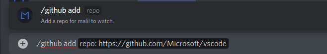

## setting up github releases with malil

Malil has a feature that allows you to stalk github repos and get new releases in your desired channels this guide will show how to set that up

#### Make sure you set your channel first

#### Then just add the repository you want to get updates for releases on

#### To view the already watched repositorys run github get

