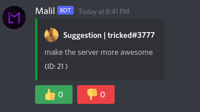

In this guide i'll teach you how to setup suggestions and how they work/look

First you need to set up the channels example shown below

:::tip You dont have to set all channels

You dont have to set the denied or accepted channel, the suggestions will just be deleted if you deny/accept them

:::

### Accepting/denying suggestions

Denied suggestion

Accepted suggestion

Accepting/denying suggestions

### Theres also a leaderboard to see the top ten most voted suggestions

### Other images

